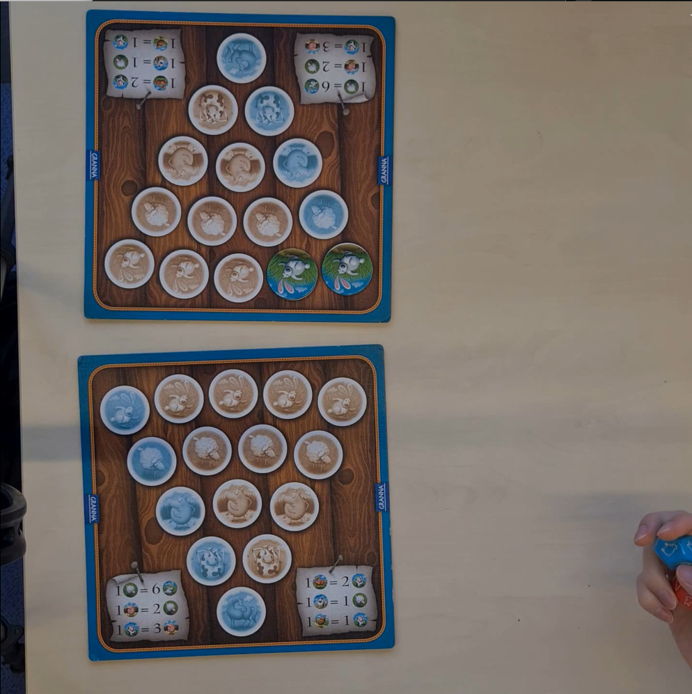
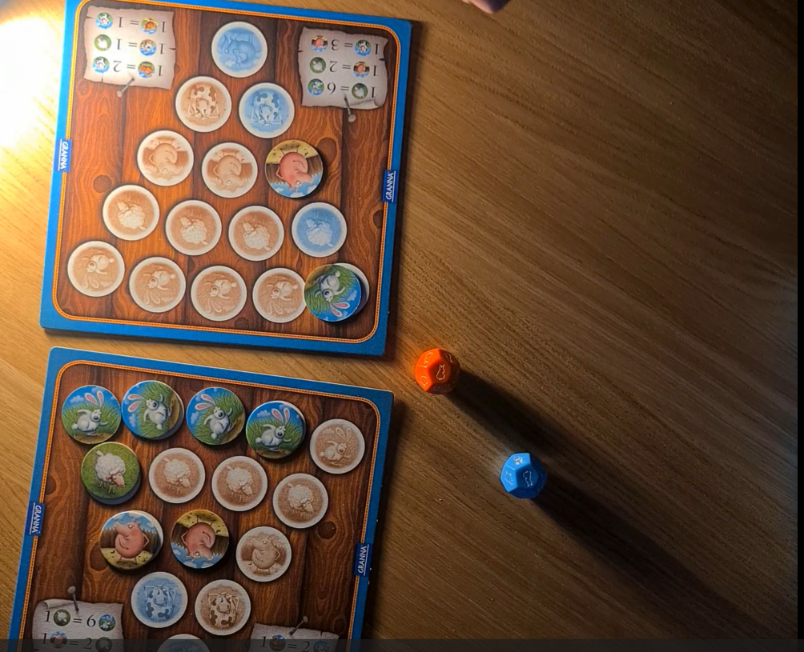
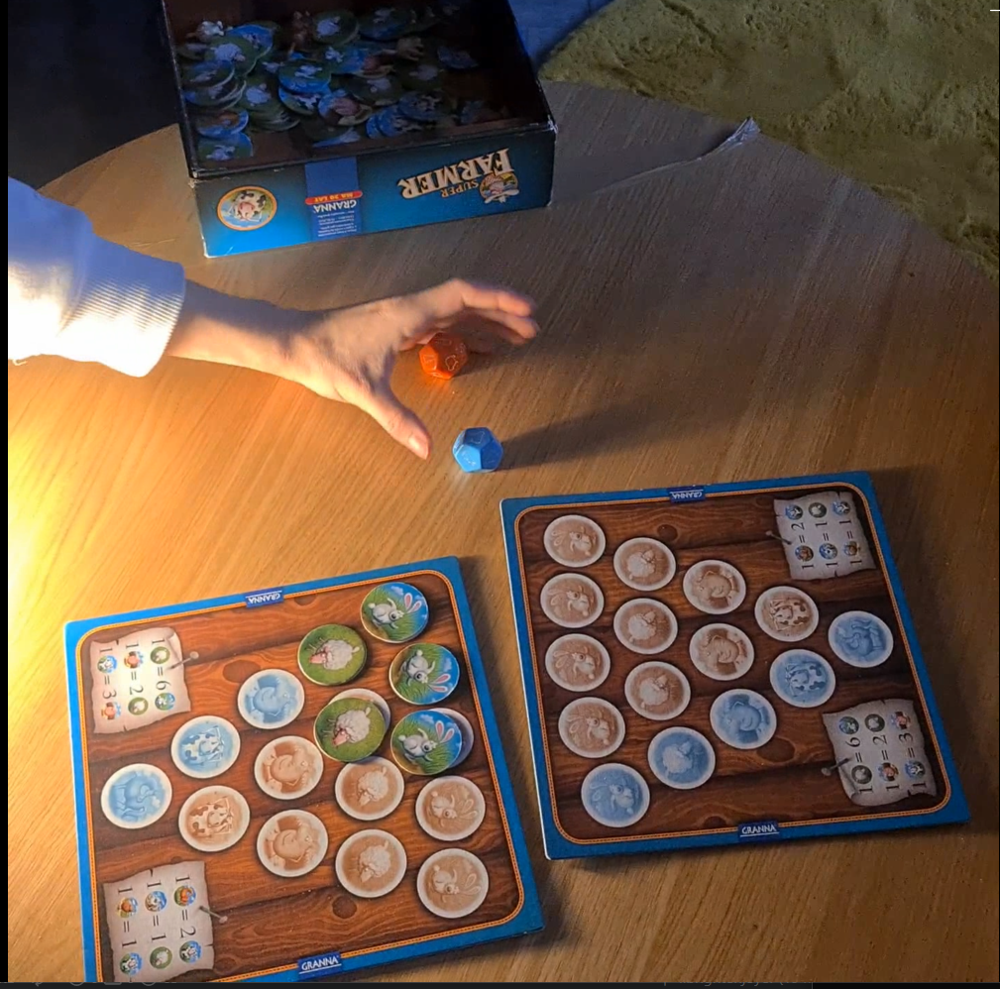
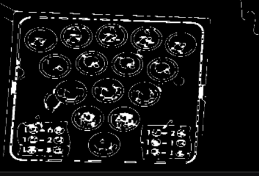
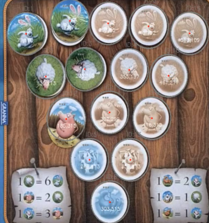
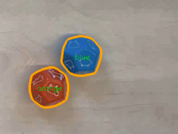

**Board Game State Recognition System**

**During the project, a sophisticated game engine for an offline and online analysis of “SuperFarmer” board game was created. This work was done to show effectiveness of simple Computer Vision tools such that descriptors, morphological operations, color analysis, Hough transform and others and that they can be used in efficient processing of simple game.**

There are some examples of engine working

*(Gif1) Example of adding chips in mittelspiel*

     

*(Gif2) Winning*

**1\. Dataset, events and objects**

*(Fig1) Photos of easy, medium and difficult groups of input data*

As a game we’ve chosen “Superfarmer” with slightly modified rules. Our dataset consists of 9 3-minutes clips of easy, medium and difficult data. Our objects are:

- Board
- 5 types of chips – rabbit, sheep, pig, cow and horse
- Orange and blue dices

As events we’ve chosen:

- Trade – whenever some chips are traded to some other ones
- Born – when a new chip is appearing on a board without trade
- Fox attack – all rabbits are lost
- Wolf attack – all animals are lost
- Loose – whenever some chip is just lost

**2\. Description of Used Techniques & Intermediate Results**

The processing pipeline is divided into several distinct stages. Below is the breakdown of techniques applied to an example frame.

**2.1. Preprocessing & Board Detection**

To isolate the game board, the system converts the frame to grayscale and applies a Bilateral Filter to reduce noise while preserving edges. Canny Edge Detection (cv2.Canny) is then used to find boundaries.

- Morphological Closing: A kernel size of (7, 7) is applied to close gaps in the edge map.
- Geometry Approximation: Instead of a simple rectangle check, the system computes the Convex Hull of contours to smooth out indentations. It then uses an Iterative approxPolyDP approach. This ensures robust detection of boards with rounded corners.
- Perspective Transform: Once the 4 corners are identified, a perspective warp is applied to flatten the board view.

*(Fig 2.1) The result of Transformations*

**2.2. Token Detection (Hough Transform)**

On the warped board image, Hough Circle Transform (cv2.HoughCircles) is employed to locate potential token slots. A search radius parameter is tuned to match the physical size of the tokens relative to the board resolution.

*(Fig 2.2) Found circles*

**2.3. Hybrid Token Classification**

A two-step hybrid classifier determines the state of each detected circle:

1.  SIFT (Scale-Invariant Feature Transform): Extracts keypoints from the Region of Interest and matches them against the reference database using a cv2.BFMatcher. This identifies the type of animal (e.g., Cow vs. Horse).
2.  Color Analysis (Lab Space): To distinguish between an actual animal token and an empty slot, which often features background artwork similar to the token, the system analyzes the Lab color space.

*(Fig 2.3) Labeling of detected circles*

**2.4. Dice Detection**

Dice are detected using color thresholding in the HSV color space, targeting Orange and Blue ranges

**2.5. System Stability & Noise Reduction**

To decrease the importance of environmental noise and tracking instability caused by player interactions (such as hand movements), several smoothing techniques were implemented:

- Exponential Moving Average: Applied to the spatial coordinates of the board's corners. This technique eliminates high-frequency jitter, ensuring the warped board view remains steady even if the raw detection fluctuates slightly frame-to-frame.
- Stability Timer: A temporal hysteresis mechanism where game state changes are registered only after the detection results remain consistent for a threshold of 20 frames (~0.7 seconds). This prevents „flickering” caused by momentary occlusions.
- Manipulation Freeze: A "Freeze Timer" that locks the game state analysis for 50 frames if a significant simultaneous reduction in tokens is detected. This feature was specifically designed to handle manual trading actions, preventing the system from interpreting the intermediate empty board state as a game event.

**2.6. Game Engine Summary**

The final stage of the pipeline is the Game Engine, which is responsible for interpreting raw detection data into high-level gameplay events. Once the system confirms a stable state change, the engine compares the current token distribution with the previous snapshot. It then resolves the differences to identify specific events—such as trades, animal births, or predator attacks—and updates the user interface with the corresponding notifications and logs.

**3\. Effectiveness for Each Dataset**

The best effectiveness of our approach was for the easy dataset. The main problems with medium and difficult dataset were to stably find a board and to find dices, due to scratched face of the table and sufficient differences in lightning, as well as to adequately label chips.

**4\. Analysis and Conclusions**

The implementation of the Board Game State Recognition System for "Superfarmer" demonstrated that a classical Computer Vision pipeline can effectively track complex game states, provided that specific stability mechanisms are in place.

Key findings:

- Hybrid Classification was a right decision: The reliance on a single detection method proved insufficient for this specific game. SIFT descriptors accurately identified the type of animal (texture matching), but failed to distinguish between an actual token and the printed artwork on an empty slot. The introduction of Lab color space analysis to check for specific color ratios (e.g., green grass vs. blue sky) significantly reduced false positives, increasing the classification accuracy.
- Robustness against Occlusions: The logical layer of the system (Game Engine) played a critical role in usability. The Manipulation Freeze and Stability Timer successfully filtered out "noise" generated by player hands during trades. Without these temporal filters, the system would generate a chaotic log of "Lost/Born" events every time a player touched the board.
- Environmental Sensitivity: As noted in the effectiveness section, the system performed optimally on the "easy" dataset but struggled with "medium" and "difficult" data. The primary causes were scratches on the table, which confused the Canny edge detector, creating false contours that interfered with board segmentation and lighting: the system is sensitive to glare on the laminated tokens and dice. Glare disrupts the gradient calculations required for Hough Circle Transform and SIFT, leading to missed detections.

Conclusion: The developed system successfully automates the tracking of game rules, including complex transactions like “Trades” and global events like “Wolf attacks” for easy clips. While the geometric and color-based approach is highly efficient, it requires controlled lighting and a clean background to function good. To improve performance on the "difficult" dataset, we could try additional improvements in suitable lines selection and maybe reshooting difficult clips on another surface of table with slightly modified conditions of lightning to make them more line detection-friendly.